- [Лабораторная работа №5: Построение AST и проверка контекстно-зависимых условий](#лабораторная-работа-5-построение-ast-и-проверка-контекстно-зависимых-условий)
- [Лабораторная работа №7: Анализ и преобразование кода с использованием Clang и LLVM](#лабораторная-работа-7-анализ-и-преобразование-кода-с-использованием-clang-и-llvm)

# Лабораторная работа №5. Построение AST и проверка контекстно-зависимых условий
## Цель работы: 
Изучить назначение и принципы работы семантического анализатора в структуре компилятора. Освоить методы построения абстрактного синтаксического дерева (AST) и проверки контекстно-зависимых условий (семантических правил) для заданной синтаксической конструкции.

## **Автор:** 

 Cтудент группы АВТ-313 Обеленец Павел Викторович

## Постановка задачи:
Вариант - Объявление и инициализация строковой константы на языке Kotlin.
### Примеры верных строк:
1) const val id = "hello";
2) const val I_1 = "";

# Контекстно-зависимые условия
1) Правило 1 (уникальность идентификаторов):
Пример:
```
const val id = "hello";
const val id = "";

Ошибка: идентификатор "id" уже объявлен ранее
```
# Структура AST:
## a) Типы узлов:
1) ConstDeclNode:
```
Атрибуты:
Name: Идентификатор (имя) объявляемой константы.
Modifiers: Список модификаторов, примененных к константе ("const", "val").
Value: Дочерний узел выражения или литерала, присваиваемого константе.

Дочерний узел:
StringLiteralNode
```
2) StringLiteralNode:
```
StringLiteralNode
Терминальный узел, представляющий строковый литерал (константу).
Атрибуты:
Value : Текстовое значение строки.
```
## b) Рисунок AST для верной строки:
Строка: const val a = "b";


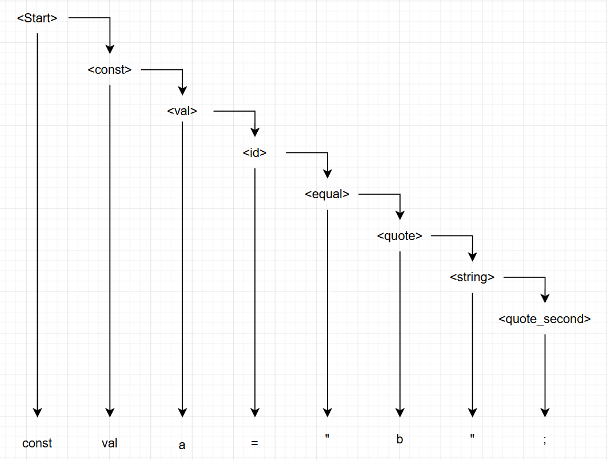
## c) Формат вывода AST в программе:
Строка: const val id= "ast";


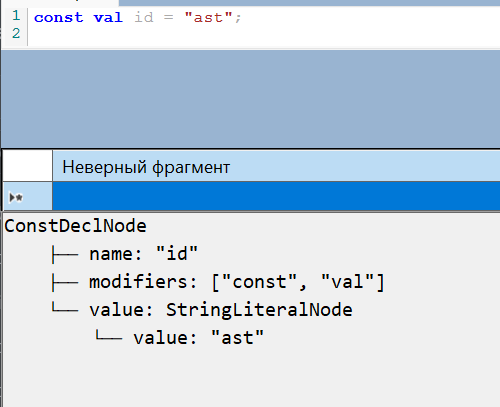

# Тестовые примеры
1) Пример Повторное объявление:
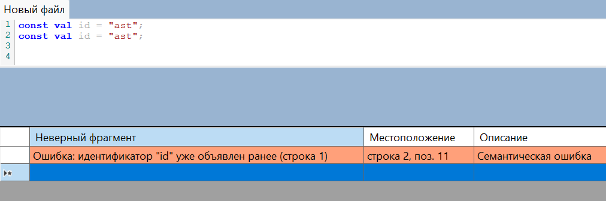

# Инструкция по запуску: 
# Инструкция по запуску проекта из Git-репозитория

В данном руководстве описано, как клонировать проект по ссылке, скомпилировать и запустить его с помощью IDE **JetBrains Rider**.

---

## Пререквизиты
Перед началом работы убедитесь, что у вас установлены:
1. **JetBrains Rider**.
2. **.NET SDK** (версия, соответствующая проекту, например, .NET 8.0).
3. Утилита **Git** (интегрированная в Rider или установленная в системе).

---

## Шаг 1: Клонирование и открытие проекта по ссылке

Вы можете импортировать проект в Rider напрямую по ссылке на репозиторий:

1. Запустите **JetBrains Rider**.
2. На стартовом экране (Welcome Screen) нажмите кнопку **Get from VCS** (или в верхнем меню: `VCS` -> `Get from Version Control...`).
3. В появившемся окне в поле **URL** вставьте ссылку на Git-репозиторий (например, `https://github.com/Pashtet2174/CompLab_5.git`).
4. В поле **Directory** укажите локальную папку на компьютере, куда будут скачаны файлы проекта.
5. Нажмите кнопку **Clone**. 
6. После завершения скачивания Rider автоматически откроет решение (`.sln`). Дождитесь окончания индексации и восстановления NuGet-пакетов.

---

## Шаг 2: Компиляция (Сборка) проекта

Чтобы убедиться, что проект собирается без ошибок:

* **Горячие клавиши:** Нажмите `Ctrl + Shift + B` (Windows/Linux) или `Cmd + Shift + B` (macOS).
* **Через меню:** В верхнем меню выберите `Build` -> `Build Solution`.
* **Через панель:** Нажмите на иконку **молотка** на верхней панели инструментов.
При успешной сборке в панели *Build* внизу появится статус: `Build Succeeded`.

# Дополнительное задание:
## Использованные графические средства:
Визуализация Ast реализована с помощью библиотеки SkiaSharp.
```
Необходимые пакеты nudget:
SkiaSharp
SkiaSharp.Views.Desktop
```
# Тестовый пример:
```
const val id = "ast";
```
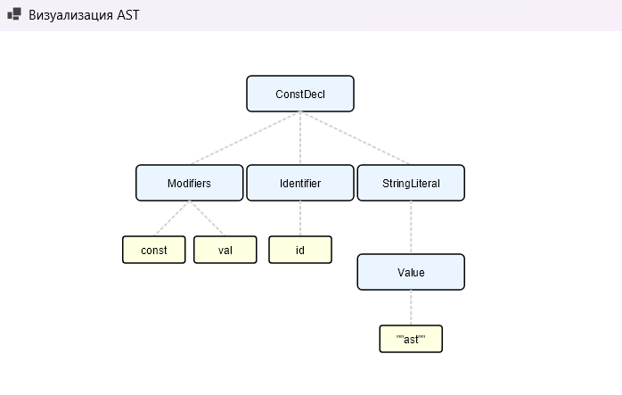

# Лабораторная работа 7. Анализ и преобразование кода с использованием Clang и LLVM

## Цель работы: 
Познакомиться с инструментарием Clang и LLVM, освоить получение абстрактного синтаксического дерева (AST) и промежуточного представления (LLVM IR) для кода на C/C++, научиться применять базовые оптимизации, строить графы потока управления (CFG), а также анализировать влияние оптимизаций на различные синтаксические конструкции языка.

## **Автор:** 

 Cтудент группы АВТ-313 Обеленец Павел Викторович

## Постановка задачи:
1) Установить Clang и LLVM;
2) Скомпилировать простой C-файл с использованием clang и
получить его: абстрактное синтаксическое дерево (AST), промежуточное
представление LLVM IR;
3) Использовать opt для применения базовой комплексной
оптимизации (например, О2);
4) Построить граф потока управления (CFG) для оптимизированной
программы;
5) Проанализировать результат, сделать выводы и ответить на
контрольные вопросы.
6) Выполнить индивидуальное задание:
```
#include <stdio.h>
int main() {
const char* msg = "Hello, World!";
printf("%s\n", msg);
return 0;
}
Задания:
1. Получите AST и IR для -O0.
2. Примените -O2 и -mergeconst.
3. Исследуйте, объединяются ли одинаковые строки.
4. Постройте CFG.
5. Сделайте вывод о том, как LLVM управляет строковыми
литералами.
```
## Основное задание:
## Установка Clang и LLVM:
```
sudo apt install update
sudo apt install clang llvm graphviz
```
## **Код задания:**
```
#include <stdio.h>
int square(int x) {
 return x * x;
}
int main() {
 int a = 5;
 int b = square(a);
 printf("%d\n", b);
 return 0;
}
```
> **Получение AST**
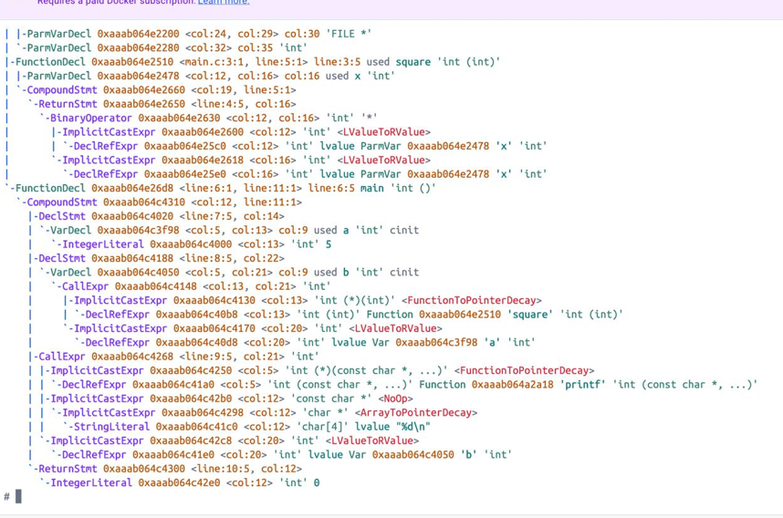 
> **промежуточное представление LLVM IR O0**
 > clang -O0 -S -emit-llvm main.c -o main_O0.ll
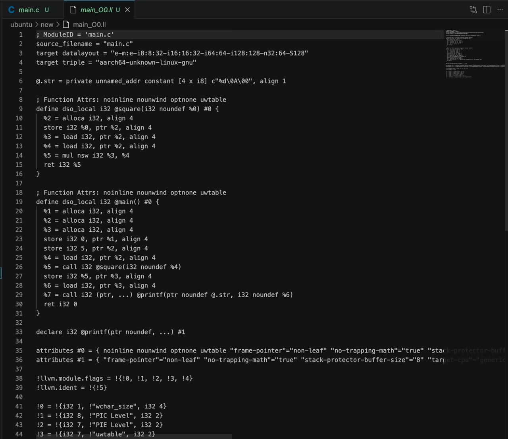
- **промежуточное представление LLVM IR O2**
> clang -O2 -S -emit-llvm main.c -o main_O2.ll
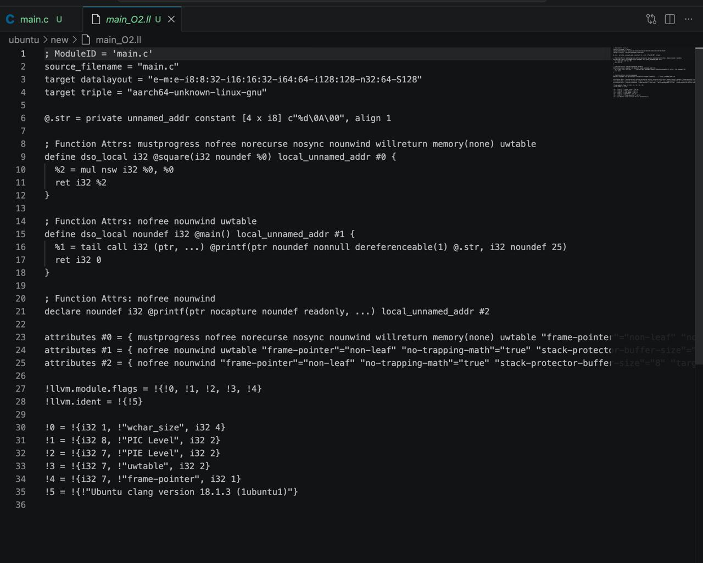
- **Сравнение оптимизаций**
> diff main_O0.ll main_O2.ll
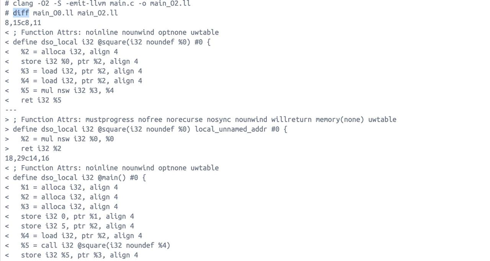
### Изменения после оптимизации:
1) Переменные типа alloca были удалены;
2) Код переведён в SSA-форму;
3) Оптимизация улучшила читаемость и упростила поток
управления.
## Построение CFG для оптимизированного LLVM IR:
**Команды для генерации CFG:**
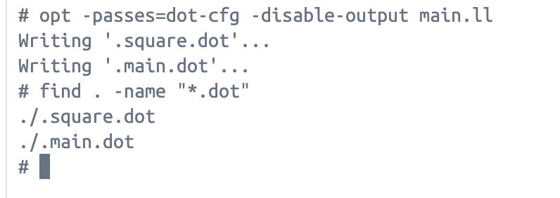
### CFG main в PNG-формате:
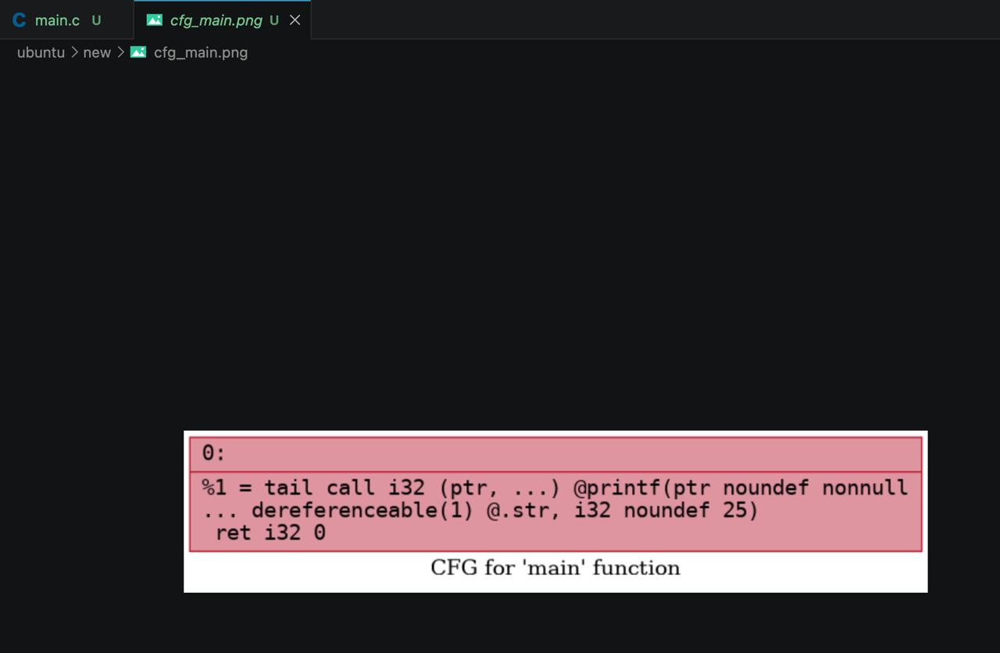
### CFG square в PNG-формате:
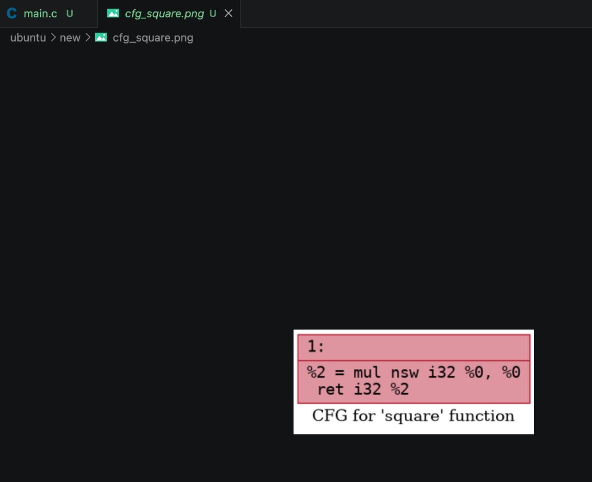 
# Индивидуальное задание:
> программа варианта:
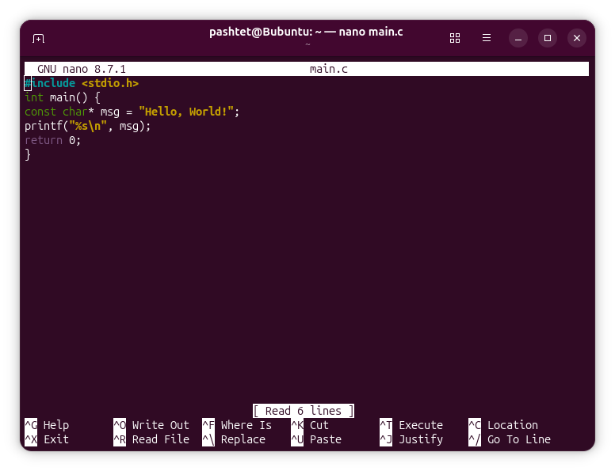 
1) Получение AST и IR для -O0.:
> AST
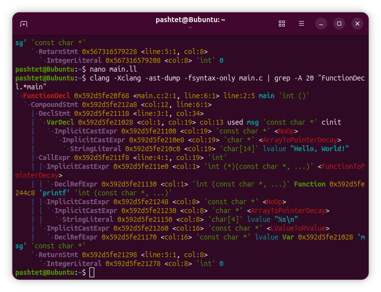 
> IR для -O0.:
```
ModuleID = 'main.c'
source_filename = "main.c"
target datalayout = "e-m:e-p270:32:32-p271:32:32-p272:64:64-i64:64-i128:128-f80:128-n8:1>
target triple = "x86_64-pc-linux-gnu"

@.str = private unnamed_addr constant [14 x i8] c"Hello, World!\00", align 1
@.str.1 = private unnamed_addr constant [4 x i8] c"%s\0A\00", align 1

; Function Attrs: noinline nounwind optnone uwtable
define dso_local i32 @main() #0 {
  %1 = alloca i32, align 4
%2 = alloca ptr, align 8
  store i32 0, ptr %1, align 4
  store ptr @.str, ptr %2, align 8
  %3 = load ptr, ptr %2, align 8
  %4 = call i32 (ptr, ...) ptr noundef @.str.1, ptr noundef %3
  ret i32 0
}

declare i32 ptr noundef, ... #1

attributes #0 = { noinline nounwind optnone uwtable "frame-pointer"="all" "min-legal-vec>
attributes #1 = { "frame-pointer"="all" "no-trapping-math"="true" "stack-protector-buffe>

!llvm.module.flags = !{!0, !1, !2, !3, !4}
!llvm.ident = !{!5}

!0 = !{i32 1, !"wchar_size", i32 4}
!1 = !{i32 8, !"PIC Level", i32 2}
!2 = !{i32 7, !"PIE Level", i32 2}
!3 = !{i32 7, !"uwtable", i32 2}
!4 = !{i32 7, !"frame-pointer", i32 2}
!5 = !{!"Ubuntu clang version 21.1.8 (6ubuntu1)"}
```
2) Получение IR -O2:
```
ModuleID = 'main.c'
source_filename = "main.c"
target datalayout = "e-m:e-p270:32:32-p271:32:32-p272:64:64-i64:64-i128:128-f80:128-n8:1>
target triple = "x86_64-pc-linux-gnu"
@.str = private unnamed_addr constant [14 x i8] c"Hello, World!\00", align 1

; Function Attrs: nofree nounwind uwtable
define dso_local noundef i32 @main() local_unnamed_addr #0 {
  %1 = tail call i32 @puts(ptr nonnull dereferenceable(1) @.str)
  ret i32 0
}

; Function Attrs: nofree nounwind
declare noundef i32 @puts(ptr noundef readonly captures(none)) local_unnamed_addr #1

attributes #0 = { nofree nounwind uwtable "min-legal-vector-width"="0" "no-trapping-math>
attributes #1 = { nofree nounwind }

!llvm.module.flags = !{!0, !1, !2, !3}
!llvm.ident = !{!4}

!0 = !{i32 1, !"wchar_size", i32 4}
!1 = !{i32 8, !"PIC Level", i32 2}
!2 = !{i32 7, !"PIE Level", i32 2}
!3 = !{i32 7, !"uwtable", i32 2}
!4 = !{!"Ubuntu clang version 21.1.8 (6ubuntu1)"}
```
3) Исследуйте, объединяются ли одинаковые строки
При объявлении двух одинаковых строковых констант в main.c при первой оптимизации -O0 было замечено что дублирование было убрано.
> Сравнение оптимизаций
```
9,19c9,11
< ; Function Attrs: noinline nounwind optnone uwtable
< define dso_local i32 @main() #0 {
<   %1 = alloca i32, align 4
<   %2 = alloca ptr, align 8
<   %3 = alloca ptr, align 8
<   store i32 0, ptr %1, align 4
<   store ptr @.str, ptr %2, align 8
<   store ptr @.str, ptr %3, align 8
<   %4 = load ptr, ptr %2, align 8
<   %5 = load ptr, ptr %3, align 8
<   %6 = call i32 (ptr, ...) ptr noundef @.str.1, ptr noundef %4, ptr noundef %5
---
> ; Function Attrs: nofree nounwind uwtable
> define dso_local noundef i32 @main() local_unnamed_addr #0 {
>   %1 = tail call i32 (ptr, ...) ptr noundef nonnull dereferenceable(1 @.str.1, ptr noundef nonnull @.str, ptr noundef nonnull @.str)
23c15,16
< declare i32 ptr noundef, ... #1
---
> ; Function Attrs: nofree nounwind
> declare noundef i32 ptr noundef readonly captures(none, ...) local_unnamed_addr #1
25,26c18,19
< attributes #0 = { noinline nounwind optnone uwtable "frame-pointer"="all" "min-legal-vector-width"="0" "no-trapping-math"="true" "stack-protector-buffer-size"="8" "target-cpu"="x86-64" "target-features"="+cmov,+cx8,+fxsr,+mmx,+sse,+sse2,+x87" "tune-cpu"="generic" }
< attributes #1 = { "frame-pointer"="all" "no-trapping-math"="true" "stack-protector-buffer-size"="8" "target-cpu"="x86-64" "target-features"="+cmov,+cx8,+fxsr,+mmx,+sse,+sse2,+x87" "tune-cpu"="generic" }
---
> attributes #0 = { nofree nounwind uwtable "min-legal-vector-width"="0" "no-trapping-math"="true" "stack-protector-buffer-size"="8" "target-cpu"="x86-64" "target-features"="+cmov,+cx8,+fxsr,+mmx,+sse,+sse2,+x87" "tune-cpu"="generic" }
> attributes #1 = { nofree nounwind "no-trapping-math"="true" "stack-protector-buffer-size"="8" "target-cpu"="x86-64" "target-features"="+cmov,+cx8,+fxsr,+mmx,+sse,+sse2,+x87" "tune-cpu"="generic" }
28,29c21,22
< !llvm.module.flags = !{!0, !1, !2, !3, !4}
< !llvm.ident = !{!5}
---
> !llvm.module.flags = !{!0, !1, !2, !3}
> !llvm.ident = !{!4}
35,36c28
< !4 = !{i32 7, !"frame-pointer", i32 2}
< !5 = !{!"Ubuntu clang version 21.1.8 (6ubuntu1)"}
---
> !4 = !{!"Ubuntu clang version 21.1.8 (6ubuntu1)"}
```
 
4) Построение CFG:
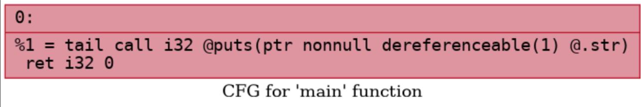

## Вывод:
> Объединение строк (String Pooling): Работает и на -O0, и на -O2. Компилятор всегда склеивает дубликаты строковых литералов в одну константу для экономии памяти.

> Устранение работы со стеком: При -O2 полностью исчезают инструкции alloca, store и load. Переменные не гоняются через оперативную память (стек), а передаются > > напрямую через регистры.

> Замена функций (Builtin Simplification): На уровне -O2 компилятор заменяет тяжелый printf("%s\n", ...) на более быстрый и легковесный puts.

> Оптимизация вызовов и атрибутов: В -O2 удаляются отладочные маркеры (optnone, frame-pointer), добавляются оптимизирующие атрибуты (nonnull, nofree) и включается > tail call (хвостовой вызов) для экономии ресурсов стека.

## Выводы
1) Что такое Clang, и какова его роль в процессе компиляции программ?  
> Clang — это фронтенд-компилятор для языков программирования C и C++. Его главная роль в процессе компиляции заключается в чтении исходного кода, проведении лексического и синтаксического анализа и построении абстрактного синтаксического дерева (AST). После проверок на ошибки Clang транслирует это дерево в промежуточное представление — LLVM IR.
2) Что представляет собой LLVM и как он используется в современных компиляторах?  
> LLVM — это набор инструментов для анализа и оптимизации кода. В современных компиляторах LLVM выступает в качестве универсального «бэкенда» (сердцевины). Он принимает промежуточное представление (LLVM IR) от различных фронтендов (например, Clang для С++, rustc для Rust), применяет к нему множество оптимизирующих трансформаций (выполняемых инструментом opt), а затем генерирует машинный код под конкретную целевую архитектуру процессора.
3) Чем отличается абстрактное синтаксическое дерево (AST) от промежуточного представления LLVM IR? 
> AST (Abstract Syntax Tree):Это высокоуровневое иерархическое представление исходного кода, которое сохраняет особенности конкретного языка программирования (например, циклы for, while, структуры, макросы). Оно используется для семантического анализа исходного текста. LLVM IR:Это низкоуровневое, линейное (напоминающее ассемблер) и независимое от исходного языка представление. В нём нет сложных синтаксических конструкций С++, зато есть строгая типизация, неограниченное количество виртуальных регистров и явные инструкции ветвления и выделения памяти

4) Для чего необходимо промежуточное представление (IR) в процессе компиляции? 
> Промежуточное представление кода удобно для написания компиляторных трансформаций и автоматических оптимизаций. Оно служит универсальным "мостом" между любым исходным языком программирования и любой целевой архитектурой процессора, позволяя разработчикам писать алгоритмы оптимизации только один раз — для самого IR.
5) Что делает инструкция alloc (alloca) в LLVM IR, и зачем она используется в функциях? 
> Инструкция alloca выделяет место для переменных в стековой памяти текущей функции. В неоптимизированном IR (при компиляции с флагом -O0) все локальные переменные изначально размещаются в памяти через alloca. Это необходимо для упрощения первоначальной генерации кода, когда значения переменных могут многократно изменяться с помощью инструкций store и load.
6) Зачем нужна оптимизация кода в компиляторе, и какие основные цели она преследует?  
> Оптимизация кода необходима для повышения эффективности программы. Комплексные оптимизации (например, уровня -O2) преследуют несколько целей:
•	Удаление лишних инструкций (например, ненужных обращений к памяти).
•	Предварительное вычисление констант на этапе компиляции (оптимизация -constprop).
•	Упрощение арифметических операций (-instcombine) и структуры потока управления (-simplifycfg).В итоге программа работает быстрее и потребляет меньше ресурсов.

7) Что такое SSA-форма и почему она важна при оптимизации программ?
> SSA (Static Single Assignment — форма статического единственного присваивания) — это свойство промежуточного представления, при котором каждой переменной (виртуальному регистру) значение присваивается ровно один раз. Оптимизатор переводит код в SSA-форму, перенося переменные из памяти (выделенной alloca) в регистры (оптимизация -mem2reg). Эта форма критически важна, так как она делает поток данных явным: компилятору гораздо проще отследить, где значение было создано и где оно используется, что ускоряет и упрощает проведение других оптимизаций.
8) Что такое граф потока управления (CFG) и как он помогает анализировать поведение программы?  
> Граф потока управления (CFG) — это инструмент для визуализации структуры кода, где узлами являются базовые блоки (последовательности инструкций без ветвлений), а ребрами — условные и безусловные переходы между ними. CFG позволяет компилятору (и человеку) наглядно анализировать маршруты выполнения программы, выявлять недостижимый код (мертвые блоки) и оптимизировать циклы.
9) Как устроено представление арифметических операций в LLVM IR (например, умножение, сложение)?
> Арифметические операции представлены в виде трехадресного кода, где инструкция (например, mulдля умножения или addдля сложения) явно принимает типизированные аргументы и сохраняет результат в новый виртуальный регистр. Например, умножение 32-битных целых чисел выглядит так: mul nsw i32 %a, %b. Инструкции строго типизированы (указан тип i32).
10) Почему функции в LLVM IR обычно представляют собой отдельные единицы анализа и оптимизации? 
> В LLVM каждый граф потока управления (CFG) строится на уровне отдельной функции, поскольку структура управления всегда локальна для тела функции. Изоляция на уровне функций (внутрипроцедурный анализ) позволяет оптимизатору работать с ограниченным и предсказуемым объемом данных, что делает компиляцию быстрой и не требующей удержания в памяти всей программы целиком.
11) Что происходит с функцией в LLVM IR, если она вызывается один раз и очень короткая?
> При включении оптимизаций (например, -O2), короткая функция встраивается прямо в место её вызова (применяется оптимизация -inline). В результате сама функция (как отдельная сущность с инструкцией ret) может быть полностью удалена из итогового кода, что устраняет накладные расходы на вызов функции и передачу параметров. Более того, если её аргументы известны на этапе компиляции, результат может быть сразу вычислен (-constprop).
12) Какие преимущества даёт использование IR и CFG для автоматических оптимизаций по сравнению с анализом исходного текста на C?
> Анализировать и оптимизировать исходный текст на C крайне сложно из-за особенностей синтаксиса, макросов, неявных приведений типов и сложного потока управления (циклы for, while, do-whileswitch, goto). LLVM IR лишен "синтаксического сахара": все типы явные, переменные находятся в SSA-форме, а поток управления стандартизирован в виде CFG. Это делает алгоритмы поиска закономерностей, упрощения выражений и удаления мертвого кода математически доказуемыми и легко реализуемыми.

# Дополнительное задание
### Семантический смысл конструкции: объявление строковой константы на языке Kotlin
> Исходная конструкция:
```
const val id ="    hello \n\t   ";
```
> IR исходной конструкции в виде трехадресного кода (TAC):
```
t1 = "    hello \n\t   "
CONST_VAL id:String = t1
```
> Оптимизация №1: Свертка/Канонизация текста (Удаление мусора и управляющих символов)
Суть: На этапе компиляции строковые константы часто очищаются от лишних непечатных символов (\t, \n), форматируются (trimming пробелов по краям).
> Результат первой оптимизации:
```
t1 = "hello"
CONST_VAL id:String = t1
```
> Оптимизация №2: удаление мёртвых временных переменных:
> Результат второй оптимизации:
```
const val id: String = "hello"
```

## Тестовыq пример двух типов оптимизаций:
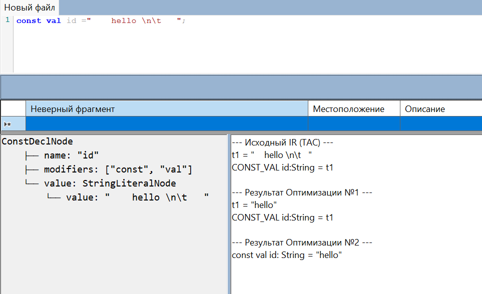
Результат после оптимизаций:
```
const val id: String = "hello"
```
### Обобщенная блок-схема первой оптимизации:
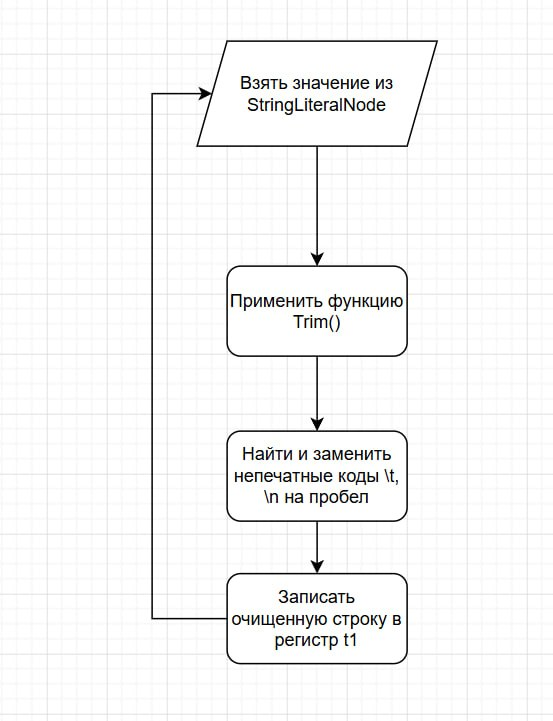
### Обобщенная блок-схема второй оптимизации:
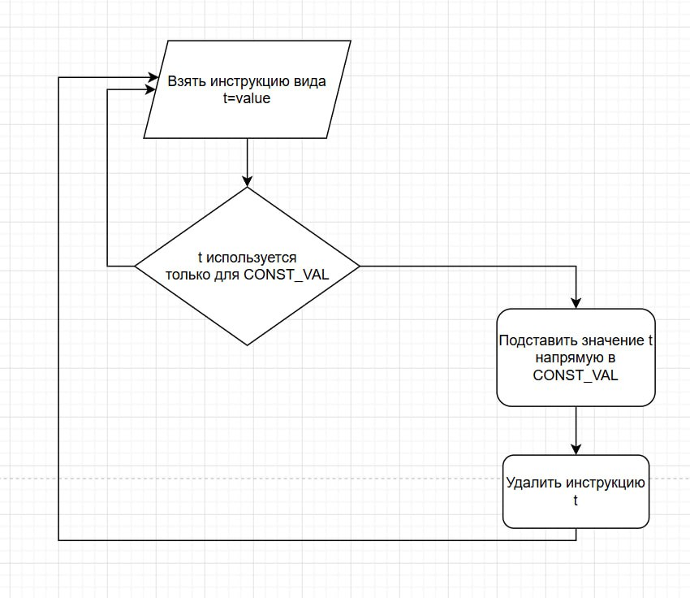
